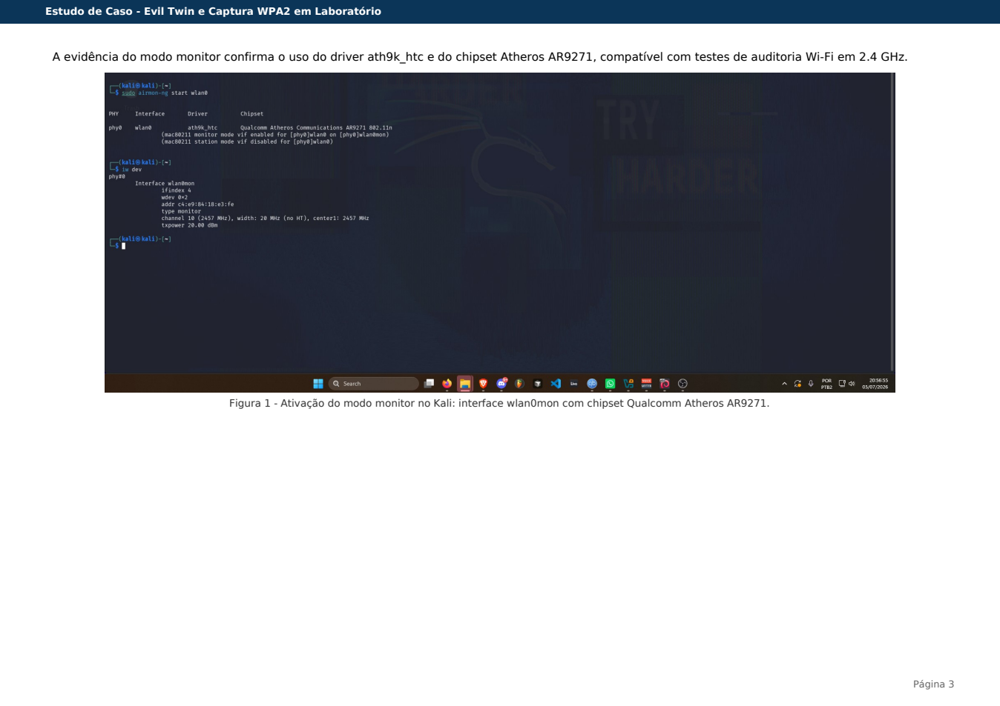
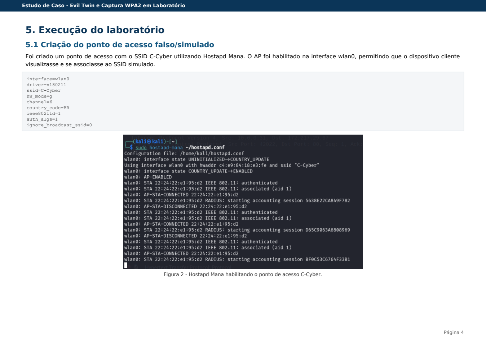
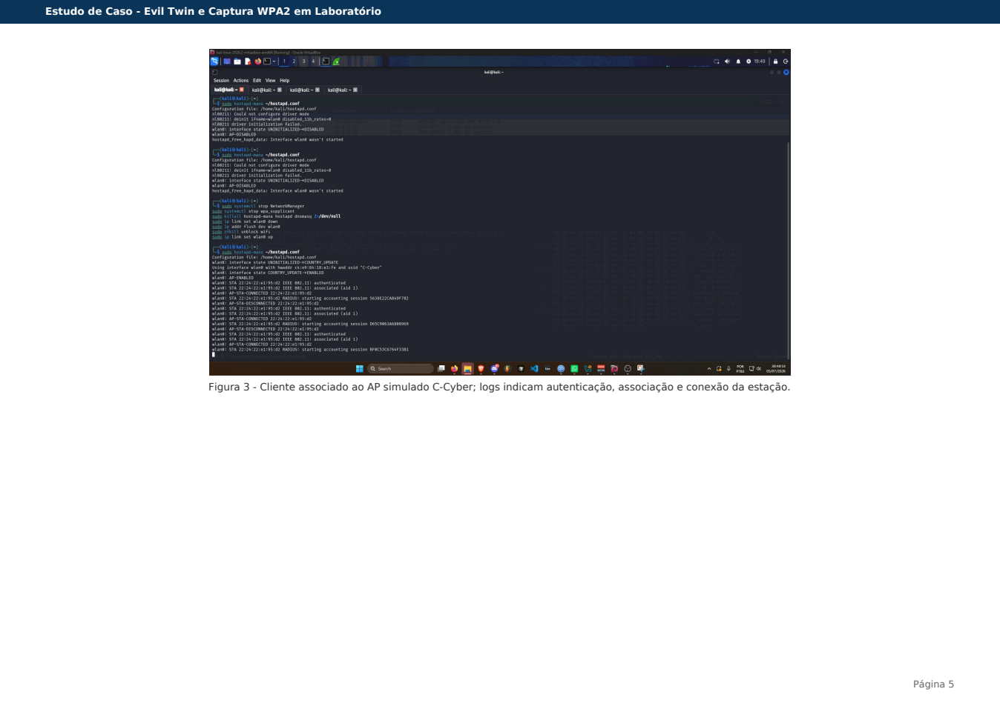
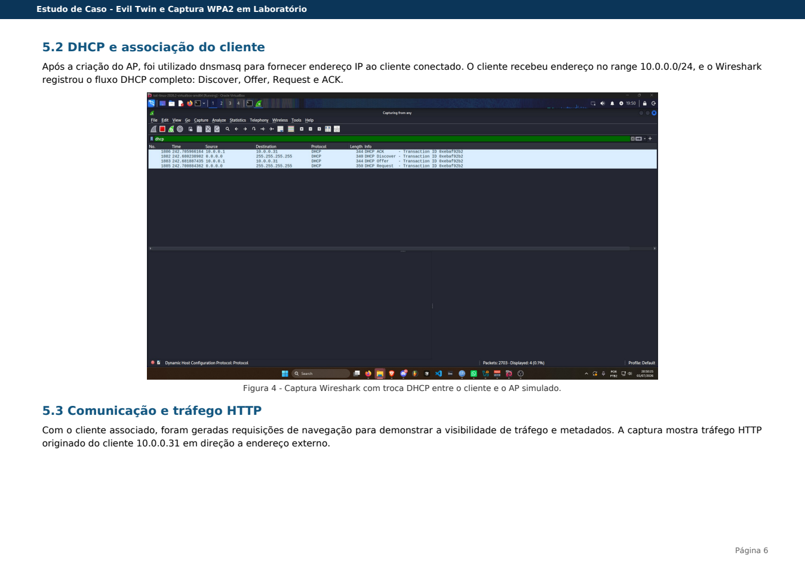
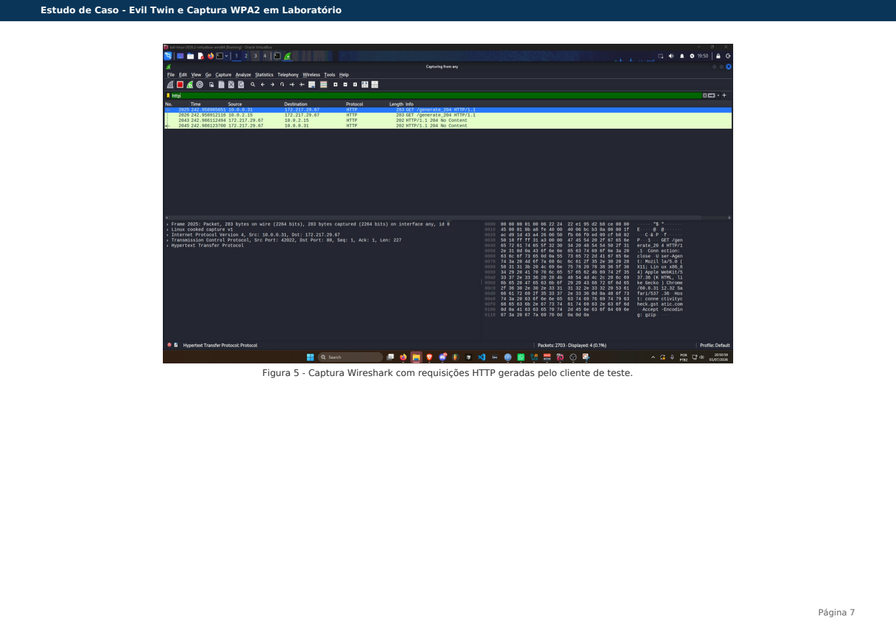
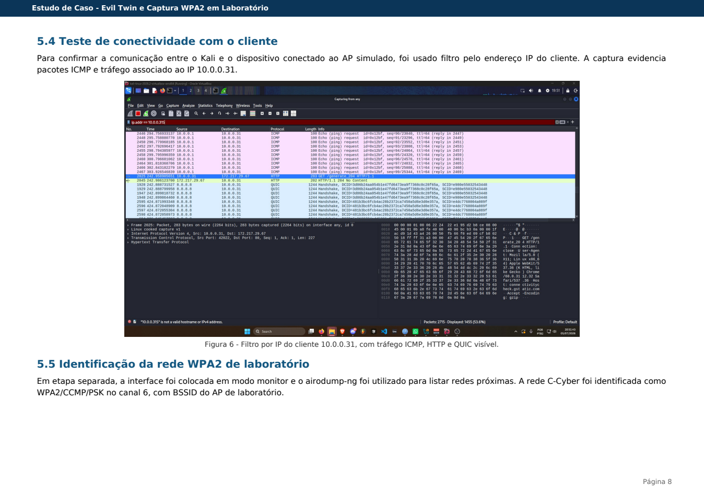
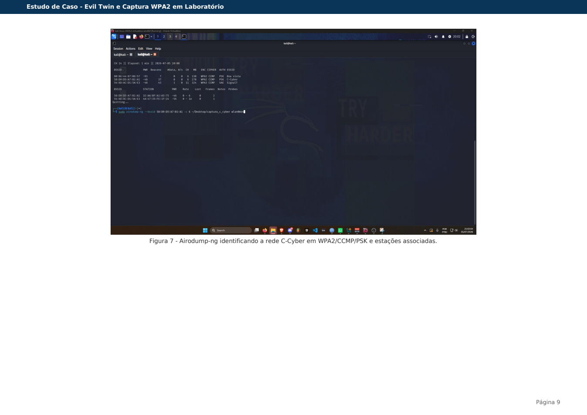
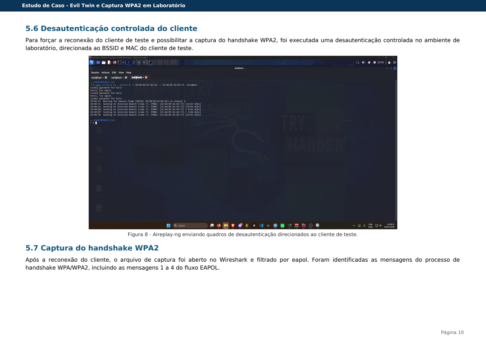
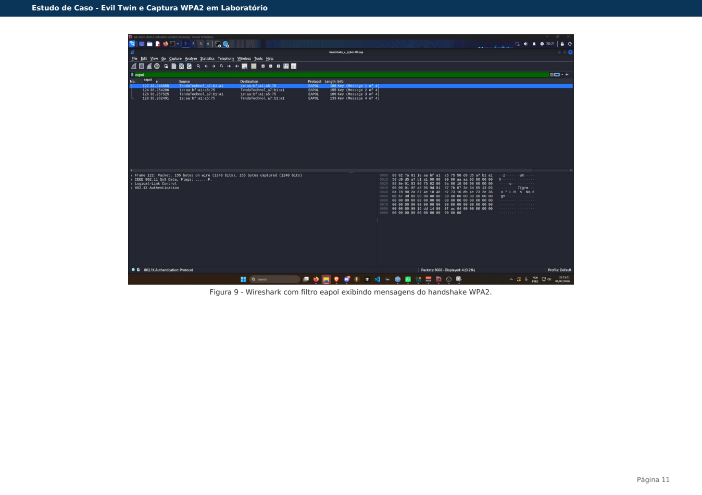
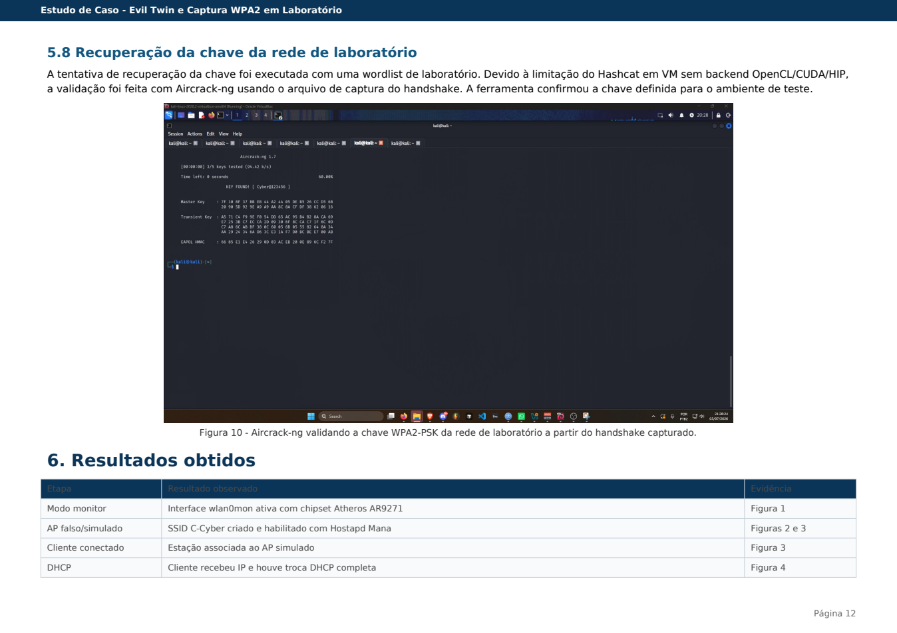

# Lab: Evil Twin e Captura WPA2 em Ambiente Controlado

## Resumo

Este estudo de caso documenta um laboratório prático sobre ataque Wi-Fi do tipo Evil Twin e captura de handshake WPA2-PSK em ambiente controlado. O experimento foi realizado como parte da minha pós-graduação, usando Kali Linux em máquina virtual, adaptador Wi-Fi compatível com modo monitor e uma rede de teste própria chamada `C-Cyber`.

O laboratório demonstrou a criação de um ponto de acesso falso/simulado, a associação de um cliente de teste, a atribuição de endereço IP via DHCP, a análise de tráfego no Wireshark e a validação de um handshake WPA2-PSK com ferramenta de auditoria.

## Objetivos

- Criar um ponto de acesso simulado com o SSID `C-Cyber`
- Conectar um dispositivo cliente de teste ao AP criado no Kali Linux
- Distribuir endereço IP ao cliente via DHCP
- Capturar e analisar tráfego de rede com Wireshark
- Capturar handshake WPA2-PSK em rede de laboratório
- Validar a chave configurada no ambiente de teste
- Registrar evidências, limitações e recomendações defensivas

## Ambiente

| Componente | Descrição |
| --- | --- |
| Sistema atacante | Kali Linux 2026.2 em Oracle VirtualBox |
| Adaptador Wi-Fi | TP-Link TL-WN722N v1.10 |
| Chipset | Qualcomm Atheros AR9271 |
| Driver | ath9k_htc |
| Cliente de teste | Smartphone conectado à rede de laboratório |
| Rede de teste | SSID `C-Cyber`, 2.4 GHz |
| Ferramentas | hostapd-mana, dnsmasq, Wireshark, airmon-ng, airodump-ng, aireplay-ng, aircrack-ng |

## Escopo e Delimitações

O enunciado original do estudo citava WPA2 Enterprise. Porém, o ambiente doméstico disponível não possuía suporte a 802.1X, RADIUS ou PEAP. Por isso, a etapa prática foi delimitada a WPA2-Personal/PSK.

A parte de WPA2 Enterprise foi tratada como conceito e limitação técnica do ambiente. O foco prático ficou em Evil Twin, associação de cliente, DHCP, captura de tráfego, handshake WPA2 e validação da senha em laboratório.

Também houve limitação no uso do Hashcat, pois a máquina virtual não tinha backend OpenCL/CUDA/HIP disponível. Como alternativa, a validação do handshake foi realizada com Aircrack-ng via CPU.

## Metodologia

### 1. Preparação da Interface Wi-Fi

A interface Wi-Fi foi configurada em modo monitor para permitir auditoria da rede de laboratório. A evidência confirmou o uso do chipset Qualcomm Atheros AR9271 com driver `ath9k_htc`, compatível com testes Wi-Fi em 2.4 GHz.

### 2. Criação do AP Simulado

Foi criado um ponto de acesso simulado com o SSID `C-Cyber` usando Hostapd Mana. O cliente de teste conseguiu visualizar e se associar ao AP criado no Kali Linux.

### 3. Atribuição de IP e Captura DHCP

Com o AP ativo, o `dnsmasq` foi utilizado para fornecer endereço IP ao cliente. No Wireshark, foi possível observar o fluxo DHCP completo, incluindo Discover, Offer, Request e ACK.

### 4. Observação de Tráfego

Após a associação do cliente, foram geradas requisições de navegação para análise no Wireshark. A captura evidenciou tráfego HTTP e metadados de comunicação originados do cliente no endereço `10.0.0.31`.

### 5. Identificação da Rede WPA2

Em uma etapa separada, a rede `C-Cyber` foi identificada como WPA2/CCMP/PSK no canal 6, com estação cliente associada.

### 6. Captura do Handshake WPA2

Foi realizada uma reconexão controlada do cliente de teste para possibilitar a captura do handshake. No Wireshark, o filtro `eapol` permitiu identificar mensagens do processo de handshake WPA/WPA2.

### 7. Validação da Chave

A validação foi feita com Aircrack-ng usando o arquivo de captura do handshake e uma wordlist de laboratório. A senha foi confirmada porque estava presente na wordlist usada no ambiente de teste.

## Resultados

| Etapa | Resultado observado |
| --- | --- |
| Modo monitor | Interface `wlan0mon` ativa com chipset Atheros AR9271 |
| AP simulado | SSID `C-Cyber` criado e habilitado |
| Cliente conectado | Estação associada ao AP simulado |
| DHCP | Cliente recebeu IP e completou troca DHCP |
| Tráfego HTTP | Requisições observadas no Wireshark |
| Conectividade | Tráfego do cliente `10.0.0.31` identificado |
| Captura WPA2 | Rede identificada como WPA2/CCMP/PSK |
| Handshake | Mensagens EAPOL capturadas |
| Validação da senha | Chave de laboratório validada com Aircrack-ng |

## Análise Técnica

O experimento demonstrou que um dispositivo pode se associar a um ponto de acesso controlado quando um SSID conhecido é apresentado em ambiente de teste. Com DHCP e roteamento configurados, torna-se possível observar metadados de rede, requisições HTTP e conexões modernas protegidas por TLS/QUIC.

A captura EAPOL confirmou o handshake WPA2-PSK durante a reconexão do cliente. A validação da chave foi possível porque a senha da rede de laboratório estava presente na wordlist utilizada. Em cenários reais, a viabilidade desse tipo de ataque depende de fatores como força da senha, método de autenticação, validação de certificados e proteções do dispositivo cliente.

## Limitações

- O ambiente não possuía WPA2 Enterprise, 802.1X, RADIUS ou PEAP
- A execução prática foi limitada a WPA2-Personal/PSK
- O Hashcat não executou na VM por falta de backend OpenCL/CUDA/HIP
- Parte do tráfego moderno usa HTTPS/TLS ou QUIC, reduzindo a exposição de conteúdo em texto claro
- O laboratório foi restrito a dispositivos próprios e ambiente controlado

## Recomendações de Segurança

- Usar senhas WPA2/WPA3 longas, únicas e resistentes a ataques de dicionário
- Desabilitar WPS em roteadores e pontos de acesso
- Preferir WPA3 quando disponível
- Manter firmware de roteadores e APs atualizado
- Em ambientes corporativos, usar WPA2/WPA3 Enterprise com validação obrigatória de certificados
- Treinar usuários para evitar redes suspeitas e certificados desconhecidos
- Monitorar SSIDs duplicados, APs não autorizados e eventos de desautenticação

## Evidências

As imagens abaixo foram extraídas do relatório final do laboratório e documentam as principais etapas executadas em ambiente controlado.

### Figura 1 - Modo monitor no Kali

### Figura 2 - AP simulado com Hostapd Mana

### Figura 3 - Cliente associado ao AP simulado

### Figura 4 - Captura DHCP no Wireshark

### Figura 5 - Tráfego HTTP no Wireshark

### Figura 6 - Filtro por IP do cliente

### Figura 7 - Identificação da rede WPA2

### Figura 8 - Desautenticação controlada

### Figura 9 - Handshake WPA2 no Wireshark

### Figura 10 - Validação com Aircrack-ng

## Nota Ética

Este laboratório foi executado apenas em ambiente controlado, com rede e dispositivos próprios/de teste. O conteúdo é destinado a aprendizado, documentação acadêmica e conscientização defensiva.
