# Lab: Investigação Forense Digital - Caso TechSecure

## Resumo

Este laboratório documenta uma investigação forense realizada em um ambiente acadêmico controlado da organização fictícia TechSecure. O cenário envolve acesso a informações confidenciais, uso de dispositivo removível, apagamento de arquivo compactado e comunicação com um serviço externo de nuvem.

A análise correlaciona evidências de sistema de arquivos, logs do Windows, vestígios de dispositivos USB e tráfego de rede. Os achados sustentam a hipótese de preparação e possível exfiltração de dados, preservando os limites técnicos das evidências disponíveis.

## Objetivos

- Preservar e analisar evidências digitais de forma reproduzível
- Validar a integridade da imagem forense com funções hash
- Identificar arquivos apagados e recuperar conteúdo relevante
- Examinar eventos de auditoria do Windows
- Correlacionar artefatos de dispositivos USB
- Analisar comunicações externas em uma captura de rede
- Avaliar os achados em relação à política interna simulada
- Separar fatos comprovados de hipóteses e inferências

## Ferramentas

- FTK Imager
- HxD
- Autopsy
- Visualizador de Eventos do Windows
- Wireshark
- Foremost
- WinRAR

## Metodologia

### 1. Preservação e integridade

A investigação foi conduzida sobre uma imagem forense segmentada, mantendo a fonte original fora do processo de análise. Valores MD5 e SHA-1 foram verificados durante a aquisição, e um SHA-256 independente foi calculado para reforçar a rastreabilidade do material examinado.

### 2. Análise do sistema de arquivos

O Autopsy foi utilizado para examinar a estrutura NTFS, metadados e arquivos não alocados. Um contêiner RAR relacionado ao cenário foi identificado como apagado, exportado e validado em uma cópia de trabalho.

### 3. Eventos do Windows

Os registros EVTX foram filtrados pelo evento 4663. A análise permitiu associar a conta e o processo registrados ao uso de um direito de acesso sobre o arquivo investigado. Esse evento foi tratado como evidência de acesso ao objeto, sem extrapolar seu significado para afirmar leitura integral ou transferência.

### 4. Vestígios de dispositivo removível

Artefatos do Registro e do `setupapi.dev.log` foram correlacionados para comprovar o reconhecimento de um dispositivo de armazenamento USB. Como o pendrive físico não foi adquirido, a presença do arquivo específico na mídia não pôde ser comprovada apenas por esses vestígios.

### 5. Tráfego de rede

A captura PCAP foi examinada no Wireshark. Foi identificada uma sessão HTTPS com infraestrutura externa poucos minutos após os eventos de acesso. A criptografia TLS permitiu confirmar a comunicação e seus volumes, mas não o nome ou conteúdo do arquivo transmitido.

### 6. Recuperação e validação

O Foremost foi executado com assinatura RAR5 e produziu candidatos que não passaram pela validação funcional. A recuperação válida ocorreu pelo Autopsy, com base nas estruturas remanescentes do sistema de arquivos. A cópia exportada foi testada e aberta com sucesso.

## Principais achados

| Achado | Avaliação |
| --- | --- |
| Preparação de arquivo compactado | Comprovada no ambiente simulado |
| Acesso ao objeto | Comprovado quanto ao direito registrado no evento 4663 |
| Apagamento do RAR | Comprovado por nome e metadados não alocados |
| Reconhecimento de dispositivo USB | Comprovado por Registro e log de instalação |
| Comunicação HTTPS externa | Comprovada pela captura de rede |
| Transferência do RAR para USB ou nuvem | Não comprovada diretamente |
| Possível exfiltração | Provável, com confiança moderada |
| Violação da política simulada | Compatível com as premissas do cenário |

## Limitações

- A evidência correspondia a um volume preparado para o laboratório, não ao disco integral do sistema
- O dispositivo USB físico não foi submetido a aquisição forense
- O conteúdo da sessão de rede estava protegido por TLS
- Não havia logs do provedor de nuvem para confirmação independente
- A memória RAM não integrou o escopo da análise
- Os candidatos recuperados por data carving não foram validados como arquivos íntegros

## Evidências

As imagens são publicadas em seus formatos originais. Clique em qualquer captura para abri-la em tamanho completo.

### 1. Validação SHA-256 da imagem forense

[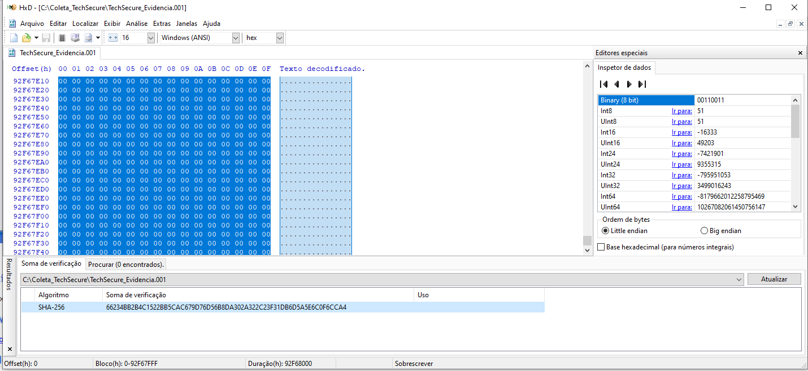](evidencias/figura-01-sha256-imagem-forense.png)

### 2. Estrutura da evidência e recuperação no Autopsy

[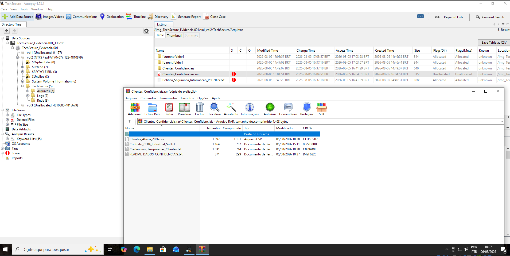](evidencias/figura-02-autopsy-estrutura-e-recuperacao.png)

### 3. Metadados do arquivo apagado

[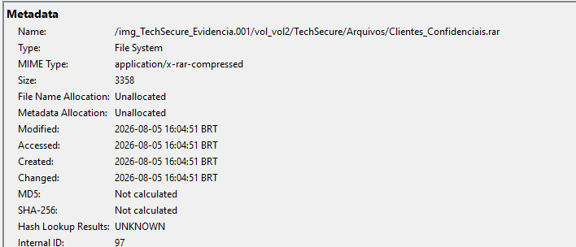](evidencias/figura-03-autopsy-rar-apagado.png)

### 4. Evento 4663 no Visualizador de Eventos

[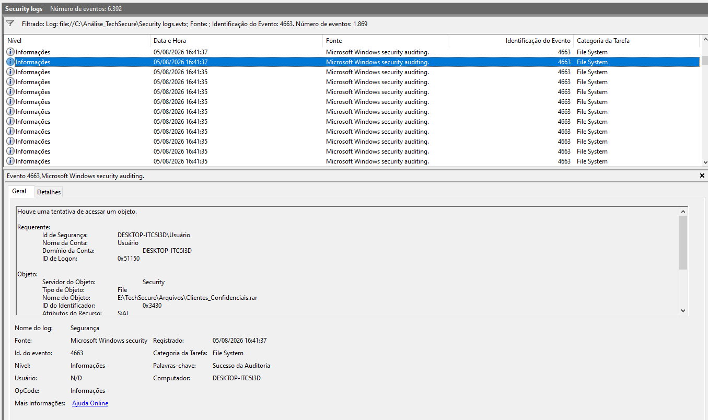](evidencias/figura-04-event-viewer-evento-4663.png)

### 5. Registros de auditoria filtrados

[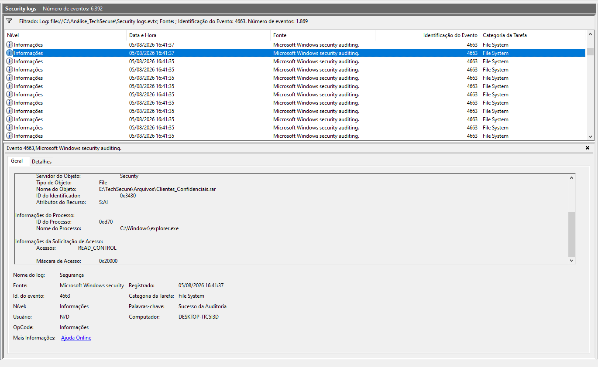](evidencias/figura-05-event-viewer-eventos-4663.png)

### 6. Detalhes do acesso ao arquivo

[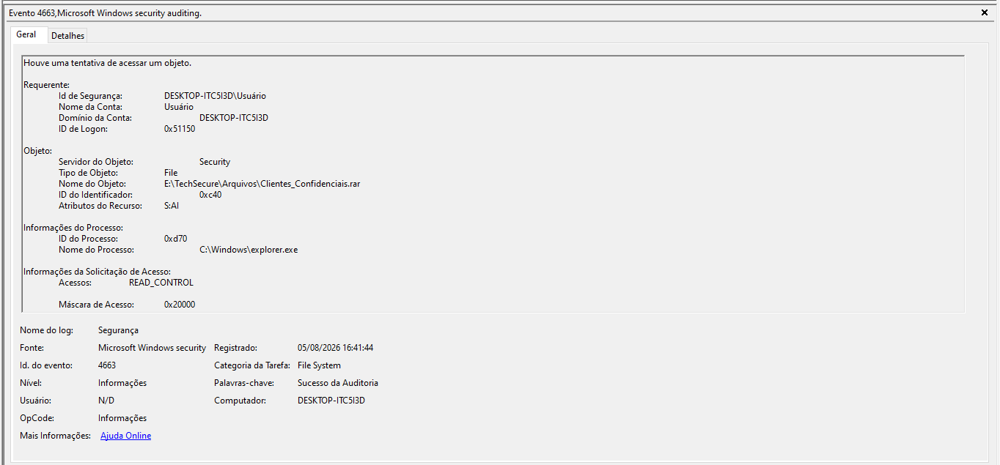](evidencias/figura-06-event-viewer-detalhe-rar.png)

### 7. Artefato USBSTOR

[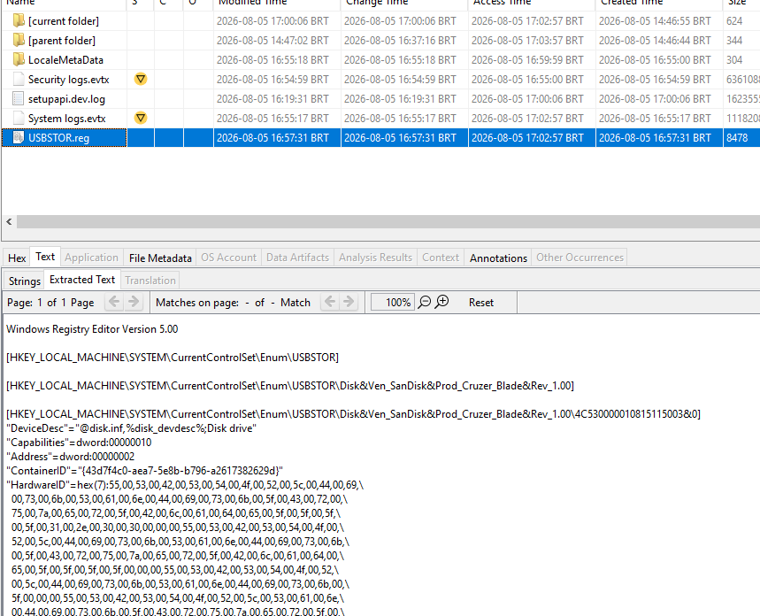](evidencias/figura-07-autopsy-usbstor.png)

### 8. Registro de instalação do dispositivo

[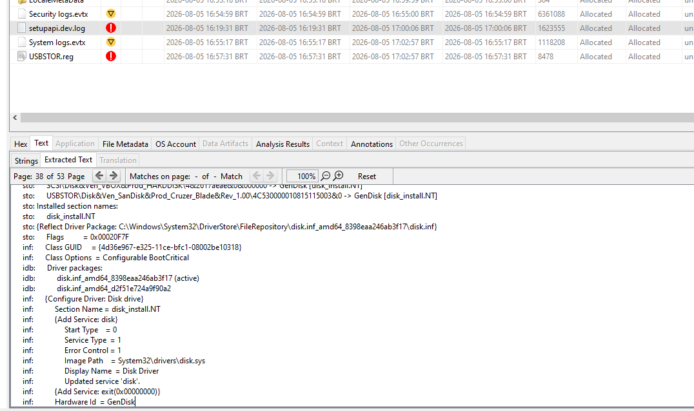](evidencias/figura-08-autopsy-setupapi.png)

### 9. Conversas de rede no Wireshark

[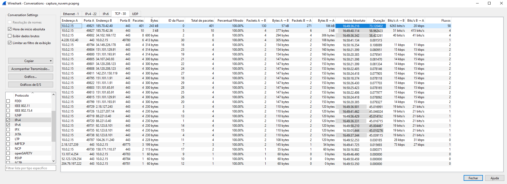](evidencias/figura-09-wireshark-conversas.png)

### 10. Política de segurança simulada

[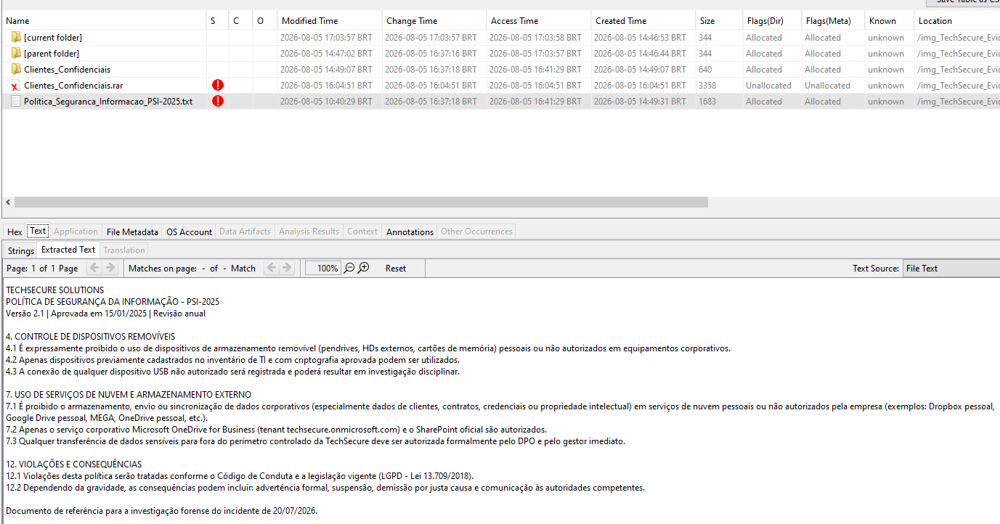](evidencias/figura-10-autopsy-politica-seguranca.png)

### 11. Auditoria do Foremost

[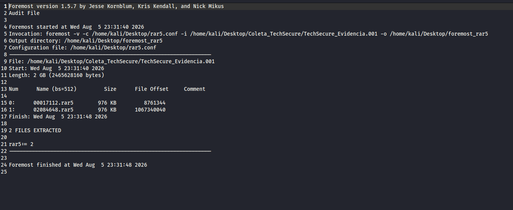](evidencias/figura-11-foremost-audit.png)

### 12. Validação do arquivo recuperado

[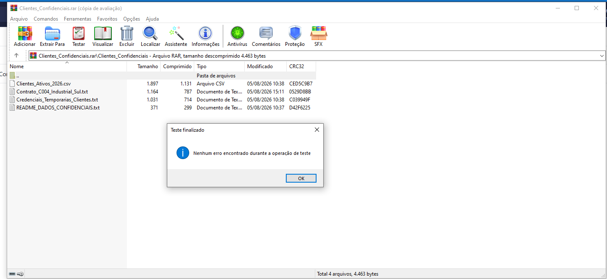](evidencias/figura-12-validacao-rar.png)

### 13. Arquivo no dispositivo removível do cenário

[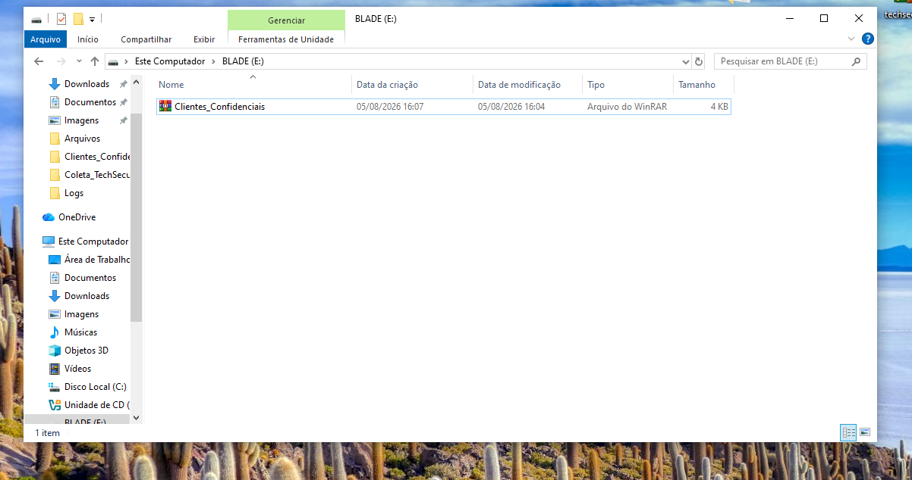](evidencias/figura-13-arquivo-no-pendrive.png)

### 14. Arquivo no serviço externo do cenário

[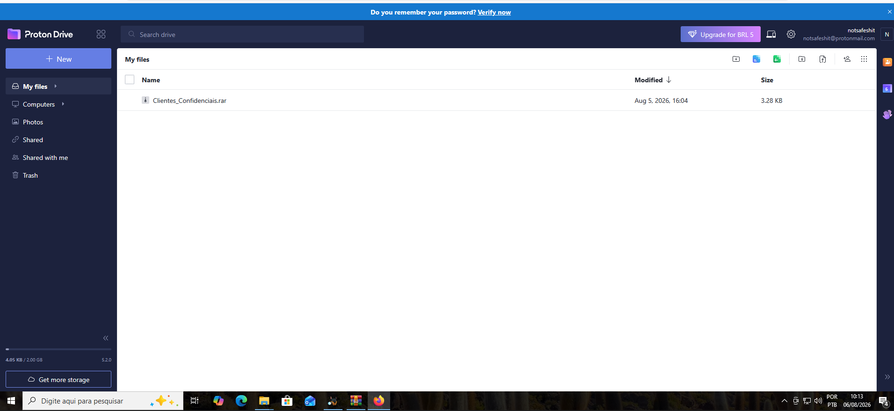](evidencias/figura-14-arquivo-no-proton-drive.png)

## Conclusão

A investigação confirmou a criação, o acesso e o apagamento de um arquivo compactado com informações sensíveis no cenário acadêmico. Também confirmou o reconhecimento de um dispositivo USB e uma comunicação HTTPS externa temporalmente próxima.

As evidências não permitem afirmar de forma conclusiva que o mesmo arquivo foi gravado no pendrive ou transmitido pela sessão criptografada. A conclusão tecnicamente adequada é de possível exfiltração, com confiança moderada, respeitando as limitações da aquisição e da análise.

## Nota ética

Este caso utiliza uma organização fictícia e dados produzidos exclusivamente para fins acadêmicos. O laboratório foi executado em ambiente controlado para desenvolver competências de preservação, análise e comunicação de evidências digitais.
