# Lab: Resposta a Incidentes com pfSense, Snort e QRadar

## Resumo

Este laboratório documenta a construção de um ambiente virtualizado para práticas defensivas de resposta a incidentes. O cenário integra firewall, IDS/IPS, SIEM e hosts Windows e Linux no Oracle VirtualBox.

O objetivo foi gerar telemetria, encaminhar logs, acompanhar atividade de rede e validar alertas de segurança para tráfego ICMP, HTTP e DNS.

## Tecnologias

- Oracle VirtualBox
- pfSense Community Edition
- Snort IDS/IPS
- IBM QRadar Community Edition
- Ubuntu e rsyslog
- Kali Linux
- Windows Server

## Atividades realizadas

- Criação e organização das máquinas virtuais
- Configuração das interfaces de rede do pfSense
- Validação da conectividade entre os ativos
- Encaminhamento de logs Linux ao QRadar com rsyslog
- Consulta de eventos e fluxos no QRadar
- Configuração do Snort na interface LAN
- Criação e teste de regras para ICMP, HTTP e DNS

## Evidências

As capturas abaixo são exibidas individualmente, preservando a proporção e a resolução de cada arquivo. Clique em uma imagem para visualizá-la em tamanho completo.

### 1. Inventário de máquinas virtuais

[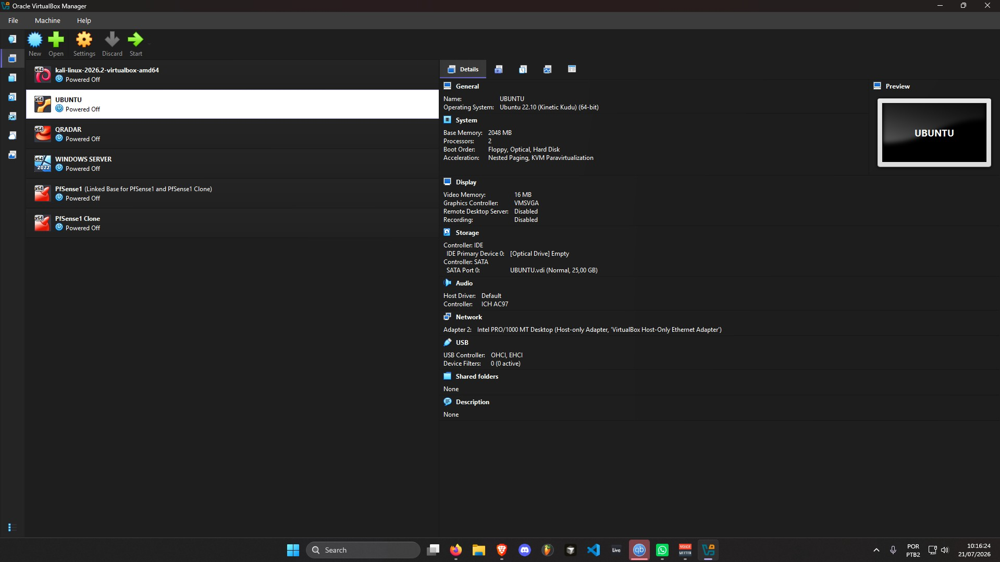](evidencias/figura-01-inventario-virtualbox.jpg)

### 2. Adaptador WAN do pfSense

[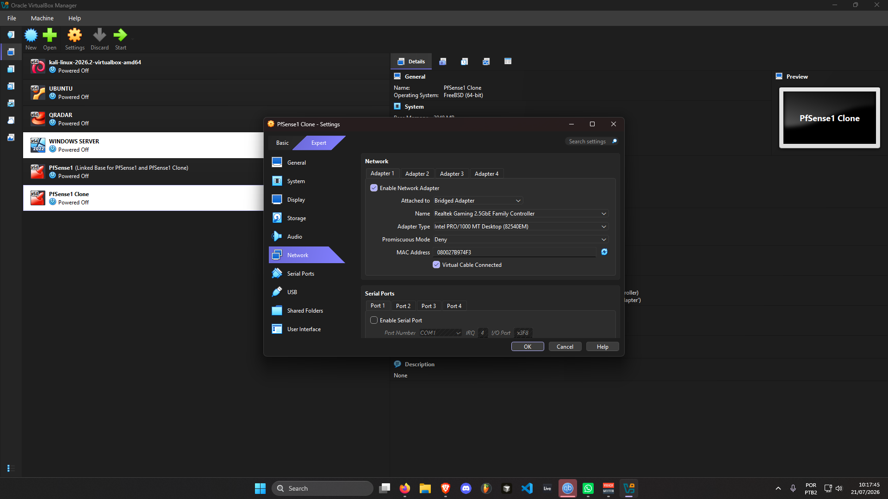](evidencias/figura-02-pfsense-adapter-wan.png)

### 3. Adaptador LAN do pfSense

[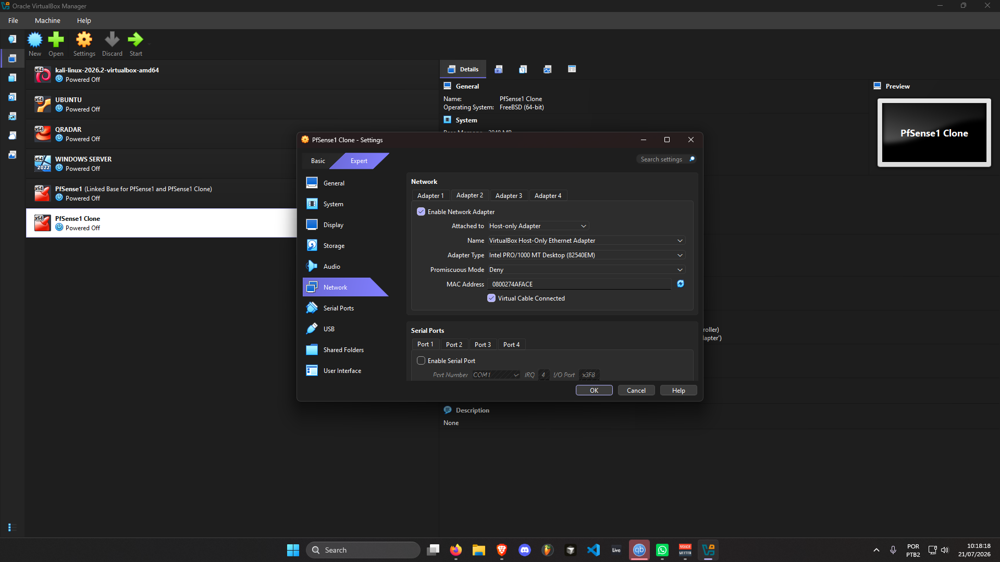](evidencias/figura-03-pfsense-adapter-lan.png)

### 4. Estado das interfaces do pfSense

### 5. Configuração do Windows Server

[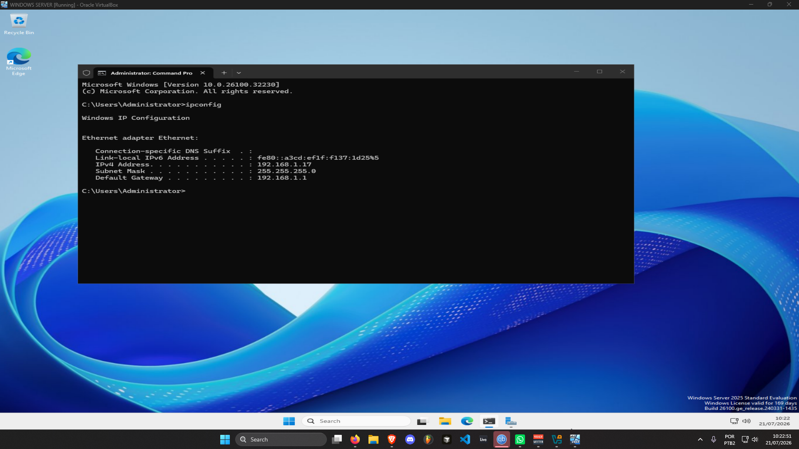](evidencias/figura-05-windows-server-ip.png)

### 6. Informações do Ubuntu

[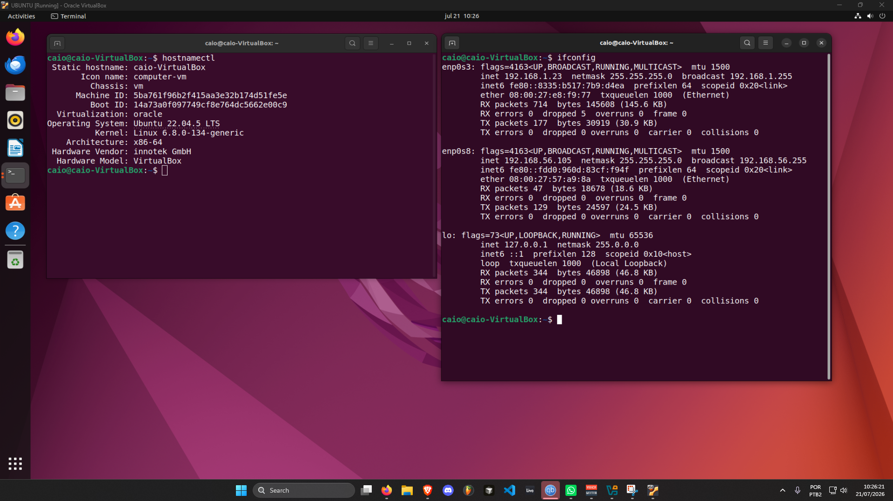](evidencias/figura-06-ubuntu-machine-info.png)

### 7. Informações do Kali Linux

[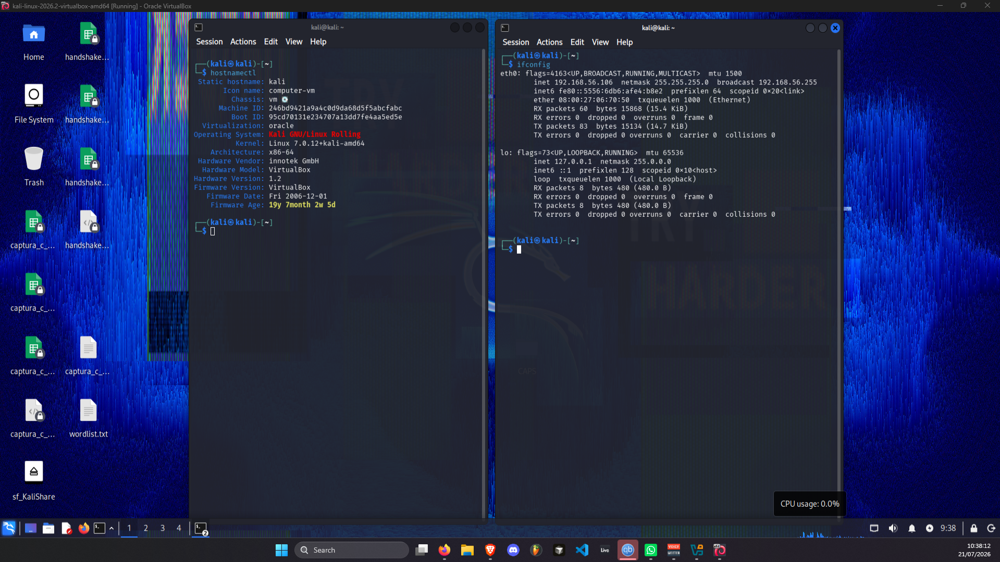](evidencias/figura-07-kali-machine-info.png)

### 8. Teste de conectividade com o pfSense

[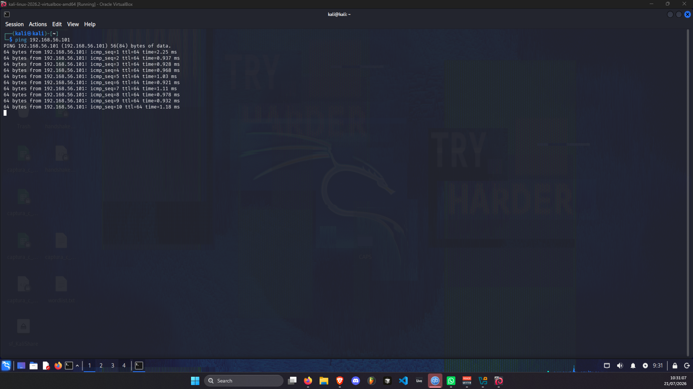](evidencias/figura-08-kali-ping-pfsense.png)

### 9. Terminal do QRadar

[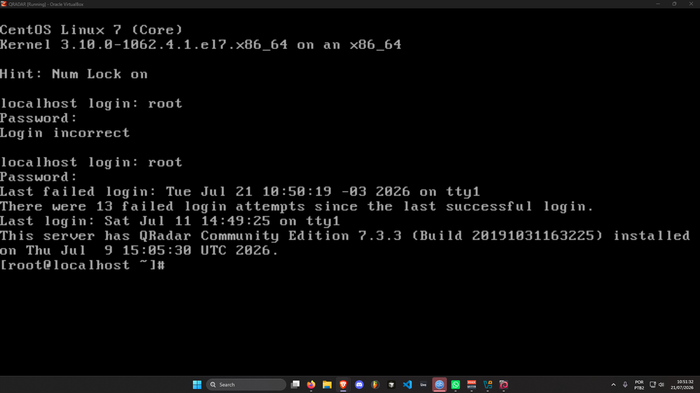](evidencias/figura-09-qradar-terminal.png)

### 10. Dashboard do QRadar

### 11. Configuração do rsyslog

### 12. Serviço rsyslog em execução

### 13. Log Activity no QRadar

[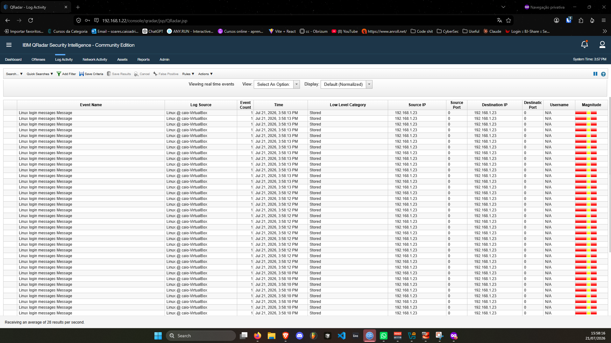](evidencias/figura-13-qradar-log-activity.png)

### 14. Detalhes de evento no QRadar

[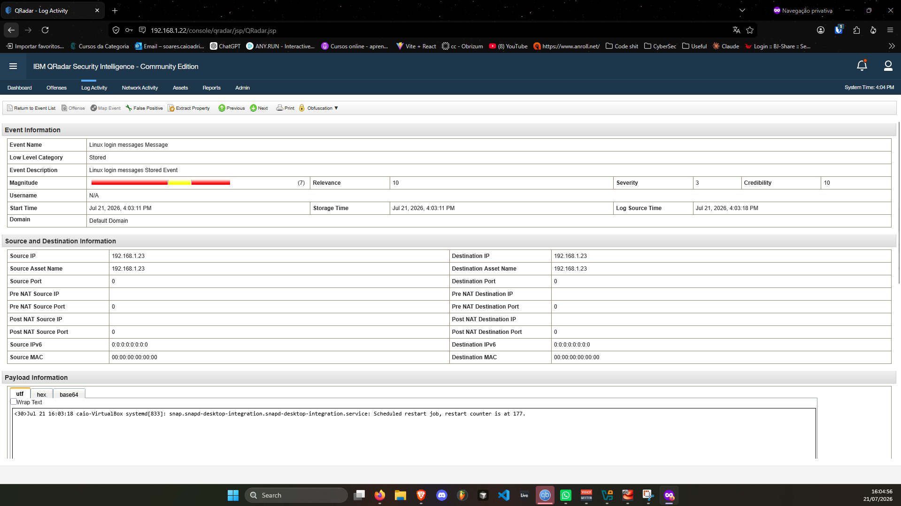](evidencias/figura-14-qradar-log-detail.png)

### 15. Network Activity no QRadar

### 16. Snort habilitado na interface LAN

[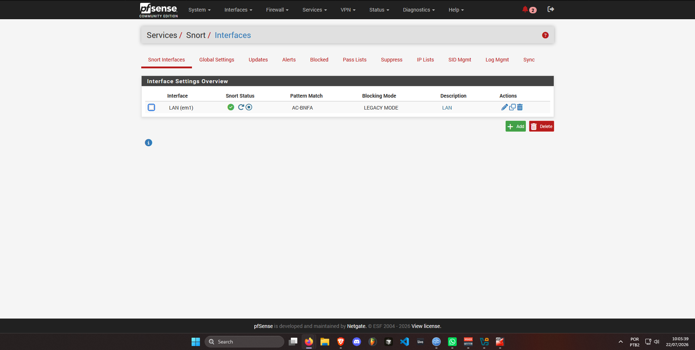](evidencias/figura-16-snort-lan-interface.png)

### 17. Regras customizadas do Snort

### 18. Alerta ICMP no Snort

### 19. Alerta HTTP no Snort

### 20. Alerta DNS no Snort

## Resultados

O ambiente permitiu acompanhar eventos Linux e atividade de rede no QRadar. As regras customizadas do Snort geraram alertas para os três tipos de tráfego testados, confirmando o funcionamento da cadeia de detecção.

## Nota ética

Todo o trabalho foi executado em ambiente controlado, com ativos próprios e finalidade acadêmica. As evidências são apresentadas para documentação técnica e desenvolvimento de competências defensivas.
