# Lab: Gestão de Vulnerabilidades com Wazuh, IA e Windows Server 2016

## Resumo

Este laboratório documenta um ciclo completo de detecção, análise, priorização, remediação e validação de vulnerabilidades em um Windows Server 2016 monitorado pelo Wazuh 4.14.7. O ambiente foi executado em máquinas virtuais no Oracle VM VirtualBox, com a comunicação entre o agente e o servidor Wazuh isolada em uma rede host-only.

Na linha de base, o Wazuh identificou 1.733 correspondências de vulnerabilidade: 35 críticas, 1.201 altas, 486 médias e 11 baixas. A CVE-2026-56190, associada ao Remote Desktop Protocol e classificada com CVSS 9,8, foi selecionada para análise aprofundada. A remediação por meio da atualização cumulativa KB5120418 elevou a compilação do Windows de 14393.0 para 14393.9418. Após a sincronização do inventário, o filtro do endpoint no Wazuh deixou de apresentar vulnerabilidades ativas.

> [Artigo acadêmico completo em PDF](documentos/artigo-wazuh-ia-windows-server-2016.pdf)

## Objetivos

- Construir um ambiente reproduzível e isolado para gestão de vulnerabilidades
- Implantar e validar o agente Wazuh no Windows Server 2016
- Registrar uma linha de base de vulnerabilidades por severidade
- Priorizar uma CVE crítica sem presumir explorabilidade automática
- Utilizar inteligência artificial como apoio à triagem e ao planejamento
- Validar as sugestões da IA com evidências locais e fontes oficiais
- Avaliar a exposição real do serviço RDP sem executar exploração
- Aplicar uma atualização cumulativa de forma controlada
- Comparar o estado do endpoint antes e depois da remediação

## Ambiente

| Componente | Configuração | Função |
| --- | --- | --- |
| Oracle VM VirtualBox | Virtualização local | Hospedagem e snapshots das VMs |
| Ubuntu com Wazuh | Wazuh 4.14.7 all-in-one, IP `192.168.56.105` | Manager, indexer e dashboard |
| Windows Server 2016 | Standard x64, agente 4.14.7, IP `192.168.56.104` | Endpoint analisado |
| Rede host-only | `192.168.56.0/24` | Comunicação isolada entre agente e manager |
| Adaptador NAT | Habilitado temporariamente | Acesso ao Windows Update durante a correção |

## Fluxo do laboratório

1. Registro da versão e do endereço do Windows Server
2. Criação de um snapshot limpo antes da instalação do agente
3. Teste de conectividade com o Wazuh nas portas necessárias
4. Instalação, inicialização e registro do agente
5. Coleta do inventário e estabelecimento da linha de base
6. Priorização da CVE-2026-56190 e consulta de seus detalhes técnicos
7. Uso de IA para organizar hipóteses e verificações não destrutivas
8. Confirmação da compilação e avaliação local da superfície RDP
9. Criação de snapshot imediatamente anterior à mudança
10. Aplicação da KB5120418 e reinicialização do servidor
11. Confirmação independente da compilação e do hotfix instalado
12. Sincronização do agente e reavaliação no Wazuh

## Uso de inteligência artificial

A inteligência artificial foi utilizada como ferramenta de apoio, e não como autoridade final. O prompt solicitou condições de exposição, verificações locais não destrutivas, prioridade, mitigação e um plano de correção, deixando explícito que a presença de uma CVE não equivale automaticamente a explorabilidade.

As sugestões úteis foram convertidas em quatro ações: confirmar a compilação do sistema, verificar se o RDP estava habilitado, verificar o estado do `TermService` e da porta TCP 3389, e aplicar uma atualização cumulativa seguida de nova coleta no Wazuh. Identificadores, pontuações, compilações e atualizações foram validados antes da execução.

## Análise de risco

O Wazuh relacionou o inventário do endpoint a 1.733 registros de vulnerabilidade. Esses registros representam correspondências entre componentes instalados e documentos de vulnerabilidade, e não necessariamente 1.733 falhas independentes e exploráveis.

A CVE-2026-56190 foi priorizada pela severidade crítica, pelo vetor de rede e pelos impactos potenciais sobre confidencialidade, integridade e disponibilidade. A verificação local mostrou, entretanto, que:

- `fDenyTSConnections` estava definido como `1`
- O serviço `TermService` estava parado
- A porta TCP 3389 não estava em escuta local

Portanto, a versão instalada permanecia afetada, mas o vetor RDP não estava exposto no momento da coleta. Essa redução de exposição não substituía a aplicação do patch, pois uma mudança futura de configuração poderia reabrir a superfície.

## Remediação

Antes da alteração, foi criado o snapshot `01-Pre-Remediation-CVE-2026-56190`. Um adaptador NAT temporário foi habilitado apenas para acesso ao Windows Update. A atualização cumulativa KB5120418 foi instalada, o servidor foi reiniciado e a busca por atualizações foi repetida até o sistema informar que estava atualizado.

Depois da remediação, o `CurrentBuild` permaneceu em 14393 e o `UBR` passou de 0 para 9418, formando a compilação `10.0.14393.9418`. O hotfix KB5120418 também foi confirmado diretamente no endpoint.

## Comparação antes e depois

| Indicador | Antes | Depois | Interpretação |
| --- | --- | --- | --- |
| Compilação do Windows | `10.0.14393.0` | `10.0.14393.9418` | Atualização cumulativa aplicada |
| Achados críticos | 35 | Sem resultados no filtro do agente | Correspondências ativas removidas após a reavaliação |
| Total de achados | 1.733 | Sem resultados no filtro do agente | Inventário pós-patch sem itens ativos naquele momento |
| Agente Wazuh | Ativo | Ativo | Telemetria preservada durante o ciclo |
| RDP/3389 | Desabilitado e sem escuta | Mantido desabilitado | Controle de exposição complementar ao patch |

## Evidências analisadas

Cada captura abaixo registra uma etapa do trabalho e explica o que ela permite concluir. Clique em qualquer imagem para abri-la no tamanho original.

### 1. Estado inicial do Windows Server 2016

**Procedimento:** `Get-ComputerInfo` e `ipconfig` foram executados antes das alterações.

**Resultado e interpretação:** a evidência identifica o Windows Server 2016 Standard x64, a compilação inicial 14393 e o endereço `192.168.56.104`, estabelecendo a referência do endpoint analisado.

[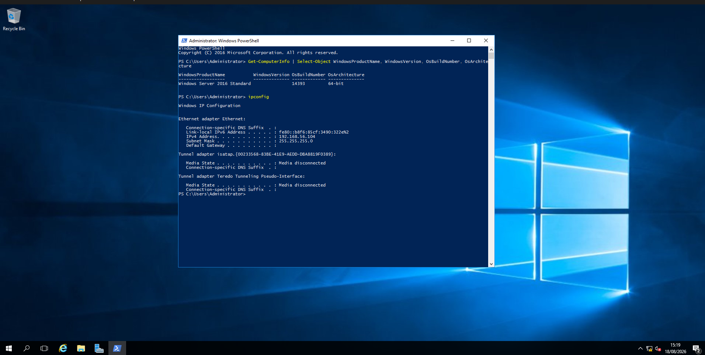](evidencias/E01-server2016-versao-inicial.png)

### 2. Snapshot limpo

**Procedimento:** foi criado um snapshot antes da instalação do agente Wazuh.

**Resultado e interpretação:** o ponto `00-Clean-Install-No-Wazuh` permite restaurar o estado inicial do laboratório e separa a instalação limpa das mudanças posteriores.

[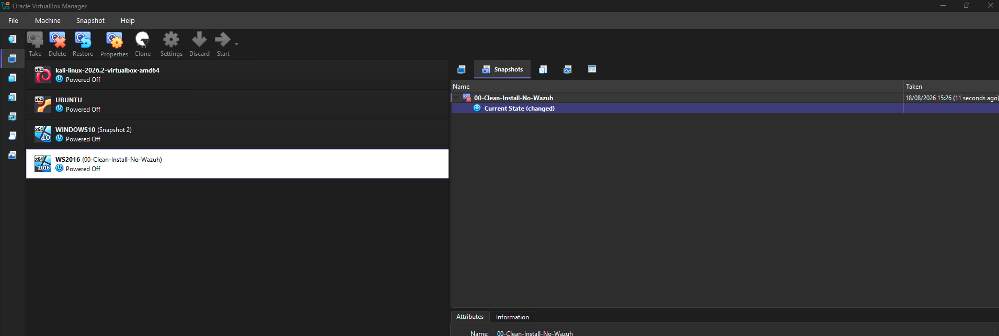](evidencias/E02-snapshot-limpo-server2016.png)

### 3. Conectividade com o Wazuh

**Procedimento:** `Test-NetConnection` foi usado para verificar as portas TCP 1515 e 1514 no manager `192.168.56.105`.

**Resultado e interpretação:** ambos os testes retornaram `TcpTestSucceeded=True`, confirmando o caminho de rede necessário ao registro e a comunicação do agente.

[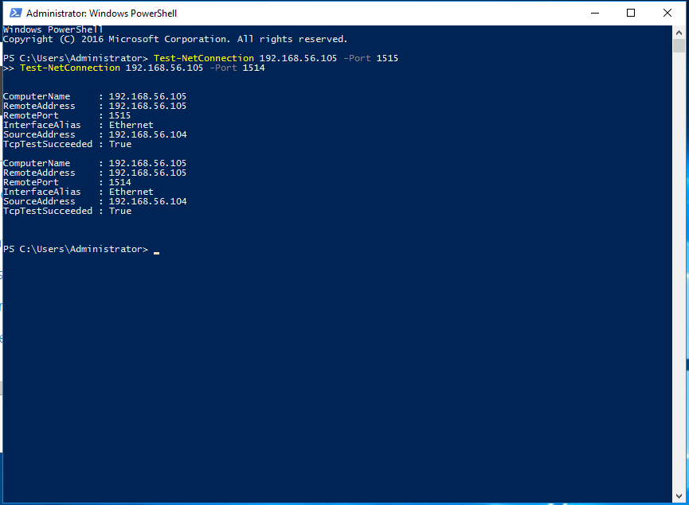](evidencias/E03-server2016-wazuh-connectivity.png)

### 4. Agente instalado e em execução

**Procedimento:** o pacote Wazuh 4.14.7 foi instalado por `msiexec`, apontando para o manager host-only, e o serviço foi iniciado.

**Resultado e interpretação:** `Get-Service WazuhSvc` mostra o estado `Running`, comprovando que o componente local estava ativo.

[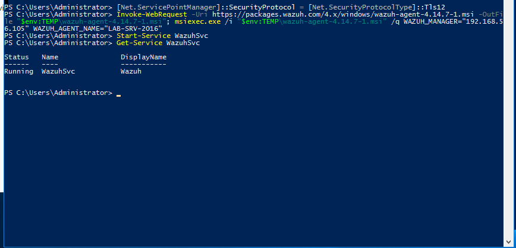](evidencias/E04-server2016-wazuh-agent-running.png)

### 5. Endpoint ativo no dashboard

**Procedimento:** a lista de endpoints foi consultada após o registro e a primeira sincronização.

**Resultado e interpretação:** `LAB-SRV-2016`, IP `192.168.56.104`, aparece ativo com o Wazuh 4.14.7 e a compilação inicial do Windows.

[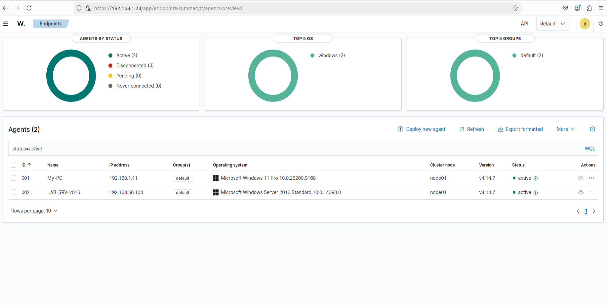](evidencias/E05-server2016-agent-active.png)

### 6. Linha de base de vulnerabilidades

**Procedimento:** o dashboard de Vulnerability Detection foi filtrado pelo agente `LAB-SRV-2016`.

**Resultado e interpretação:** o Wazuh registrou 35 achados críticos, 1.201 altos, 486 médios e 11 baixos, totalizando 1.733 correspondências para priorização.

[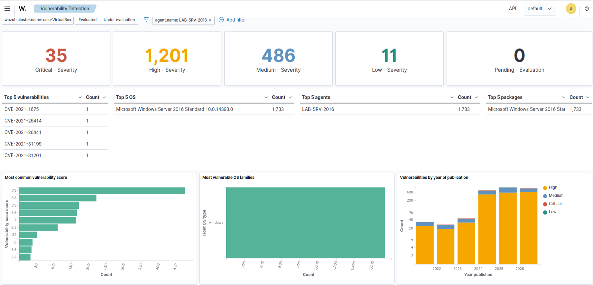](evidencias/E06-server2016-vulnerability-baseline.png)

### 7. Inventário de vulnerabilidades críticas

**Procedimento:** o inventário foi filtrado pela severidade `Critical`.

**Resultado e interpretação:** 35 registros foram apresentados. A listagem permitiu selecionar uma vulnerabilidade relevante para análise aprofundada sem assumir que todas estavam igualmente expostas.

[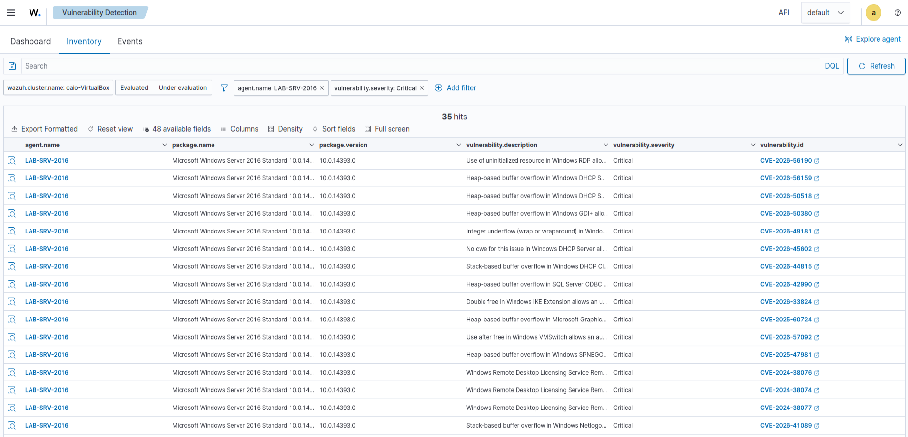](evidencias/E07-server2016-critical-vulnerabilities.png)

### 8. Detalhes da CVE-2026-56190

**Procedimento:** o registro da CVE selecionada foi consultado no Wazuh CTI.

**Resultado e interpretação:** a página informa CVSS 9,8, vetor de rede, baixa complexidade e impactos altos. Esses dados justificam prioridade elevada, mas ainda exigem validação da configuração e da exposição do endpoint.

[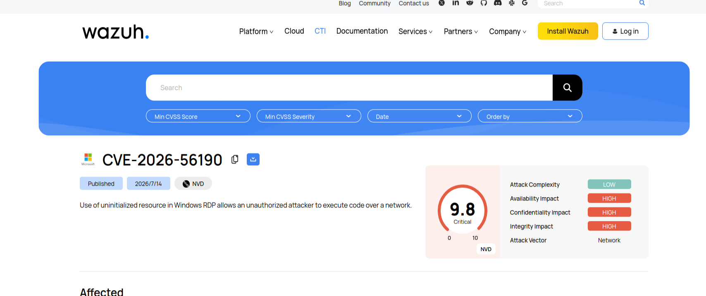](evidencias/E08-cve-2026-56190-technical-detail.png)

### 9. Compilação anterior à remediação

**Procedimento:** as propriedades `CurrentBuild` e `UBR` foram consultadas diretamente no Registro.

**Resultado e interpretação:** os valores 14393 e 0 confirmam a compilação `10.0.14393.0`, coerente com um sistema sem as atualizações cumulativas recentes.

[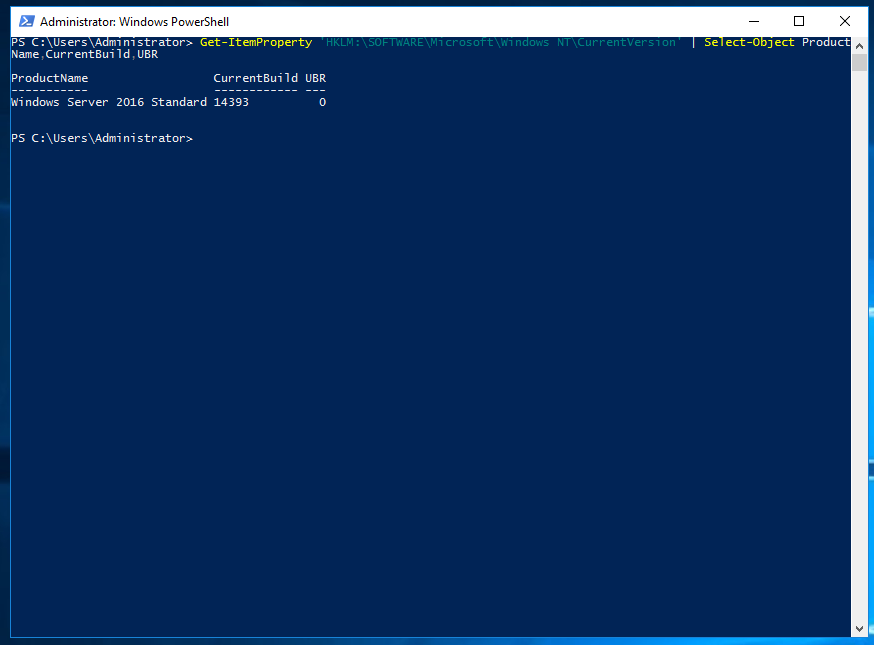](evidencias/E09-server2016-build-before-remediation.png)

### 10. Avaliação da exposição RDP

**Procedimento:** foram verificados `fDenyTSConnections`, o serviço `TermService` e a porta local TCP 3389.

**Resultado e interpretação:** o RDP estava desabilitado, o serviço parado e a conexão local falhou. A superfície não estava exposta durante o teste, embora a versão afetada ainda precisasse ser corrigida.

[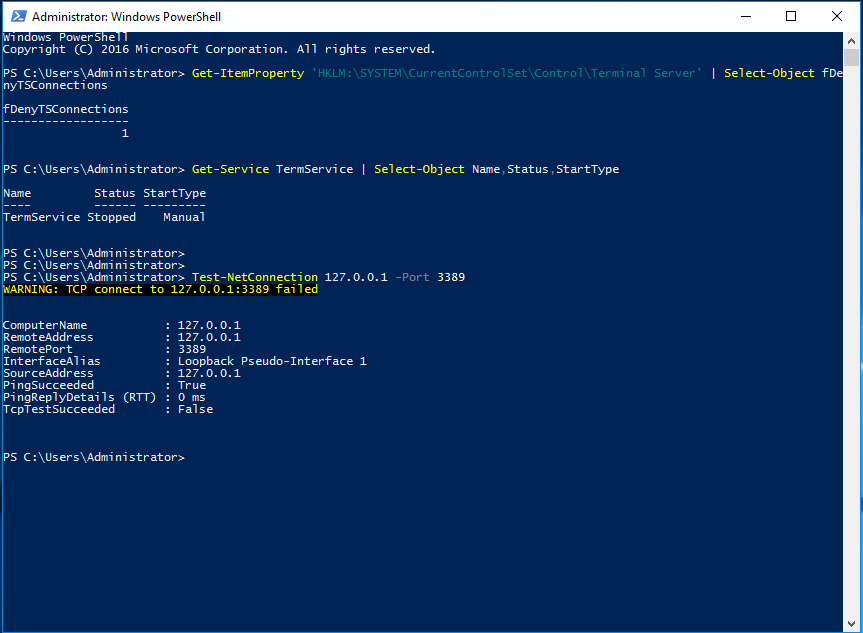](evidencias/E10-server2016-rdp-exposure-before-remediation.png)

### 11. Snapshot anterior à mudança

**Procedimento:** um novo snapshot foi criado imediatamente antes da instalação da atualização.

**Resultado e interpretação:** `01-Pre-Remediation-CVE-2026-56190` registra um ponto de retorno e demonstra controle de mudança no ambiente virtualizado.

[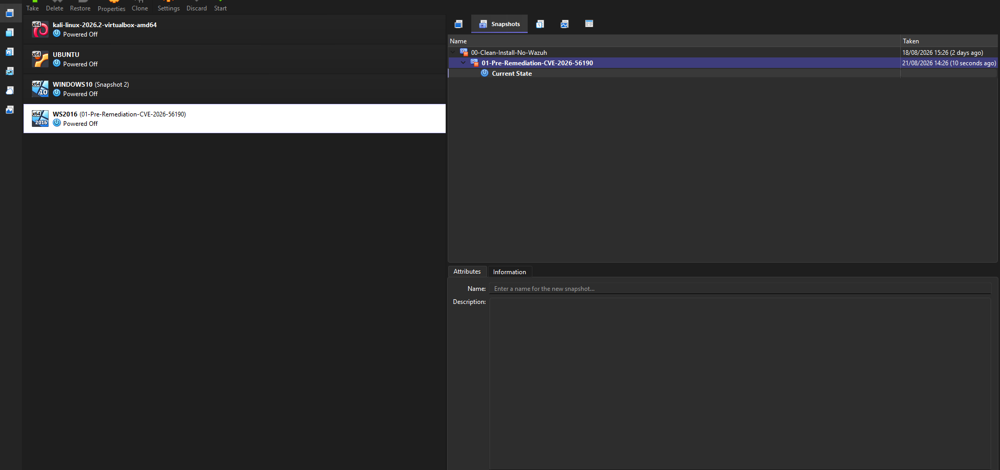](evidencias/E11-server2016-pre-remediation-snapshot.png)

### 12. Atualizações disponíveis

**Procedimento:** um adaptador NAT temporário foi habilitado e o Windows Update foi consultado.

**Resultado e interpretação:** a KB5120418 aparece entre as atualizações prontas para instalação, ligando o plano de remediação a um pacote fornecido pelo fabricante.

[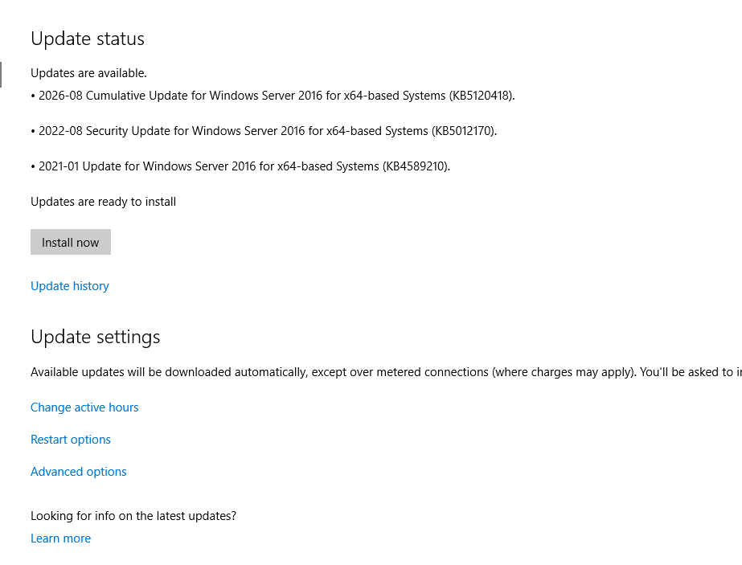](evidencias/E12-server2016-initial-updates-available.png)

### 13. Windows Update concluído

**Procedimento:** as atualizações foram instaladas, o servidor foi reiniciado e a verificação foi repetida.

**Resultado e interpretação:** a interface informa que o dispositivo está atualizado, indicando a conclusão do ciclo de instalação. A comprovação técnica da versão é feita na evidência seguinte.

[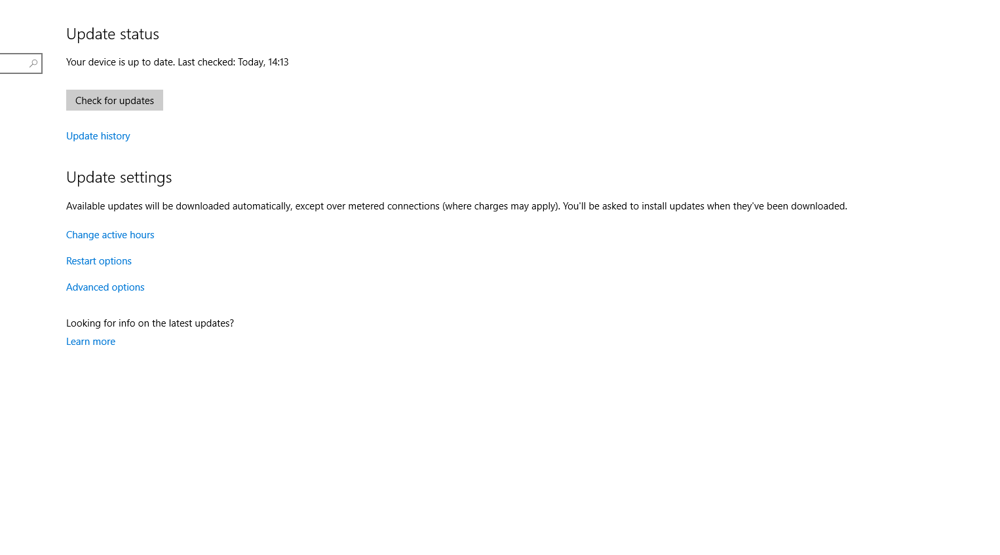](evidencias/E13-server2016-windows-update-complete.png)

### 14. Compilação e hotfix depois da remediação

**Procedimento:** a compilação foi consultada novamente e `Get-HotFix` foi usado para confirmar a KB instalada.

**Resultado e interpretação:** o UBR passou para 9418 e a KB5120418 aparece instalada, fornecendo duas evidências independentes da mudança no endpoint.

[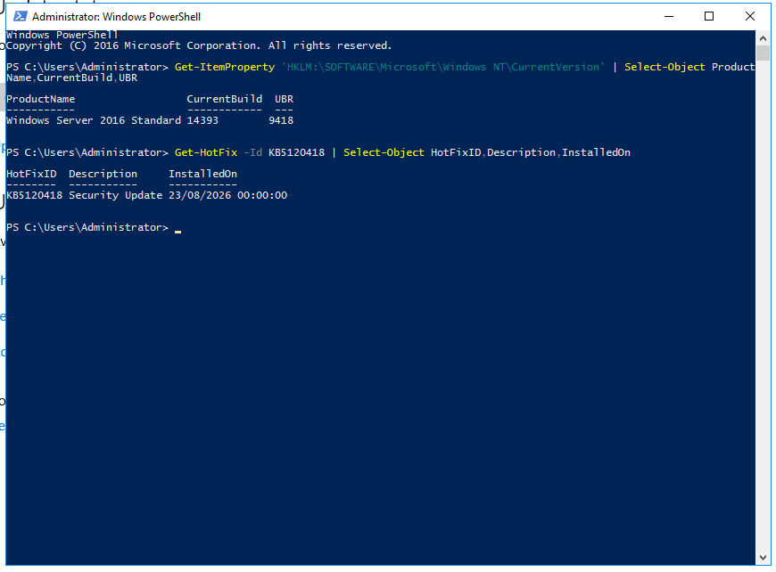](evidencias/E14-server2016-build-and-kb-after-remediation.png)

### 15. Agente ativo após a remediação

**Procedimento:** o dashboard de endpoints foi revisado depois da atualização e da sincronização do inventário.

**Resultado e interpretação:** o agente continua ativo e o Wazuh passa a exibir a compilação `10.0.14393.9418`, demonstrando que a telemetria foi preservada e o inventário atualizado.

[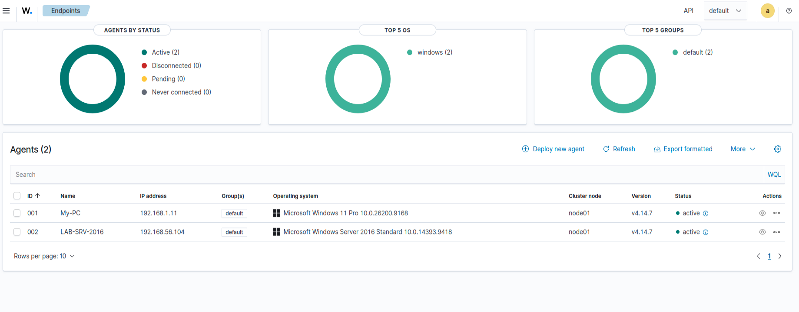](evidencias/E15-server2016-agent-active-after-remediation.png)

### 16. Reavaliação final no Wazuh

**Procedimento:** o inventário de vulnerabilidades foi aberto para o agente de ID 002 depois da nova coleta.

**Resultado e interpretação:** a consulta retornou `No results match your search criteria`. No contexto desse filtro e naquele momento, não havia registros ativos para o endpoint. O resultado não constitui garantia permanente de ausência de falhas, pois o inventário pode mudar com novas CVEs, softwares ou atualizações do catálogo.

[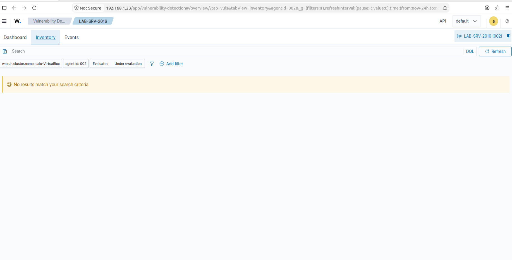](evidencias/E16-server2016-zero-vulnerabilities-after-remediation.png)

## Limitações

- O laboratório avaliou um único endpoint e aprofundou uma CVE crítica
- Não foram executadas provas de conceito, exploração ou tráfego ofensivo
- A verificação da porta 3389 foi local, sem validação externa adicional
- A ausência de resultados representa o estado observado e indexado naquele momento
- Snapshots facilitam o retorno no laboratório, mas não substituem backups testados em produção
- A IA organizou a análise, mas suas sugestões dependeram de validação humana e documental

## Recomendações

- Manter um ciclo recorrente de inventário, priorização, patching e reavaliação
- Correlacionar severidade com exposição de rede, configuração e importância do ativo
- Validar recomendações geradas por IA antes de executar comandos ou mudanças
- Restringir administrativamente o RDP e expor o serviço somente quando necessário
- Remover acessos temporários à Internet depois da manutenção
- Preservar backups, registros de mudança e planos de reversão testados
- Planejar a migração de sistemas próximos ao fim do suporte

## Conclusão

O laboratório demonstrou que a gestão de vulnerabilidades não termina na detecção. A linha de base orientou a priorização, a análise local distinguiu severidade teórica de exposição real, a atualização foi aplicada sob controle de mudança e o resultado foi confirmado tanto no endpoint quanto no Wazuh.

A IA agregou valor ao estruturar a triagem e lembrar verificações relevantes, mas a decisão permaneceu baseada em evidências e validação humana. O resultado final foi a atualização do Windows Server 2016 para a compilação `10.0.14393.9418`, com o agente ativo e sem correspondências de vulnerabilidade no filtro do endpoint durante a validação.

## Nota ética

Todo o trabalho foi executado em ambiente virtualizado e controlado, com finalidade acadêmica e defensiva. Não houve exploração da vulnerabilidade nem interação com sistemas de terceiros.

